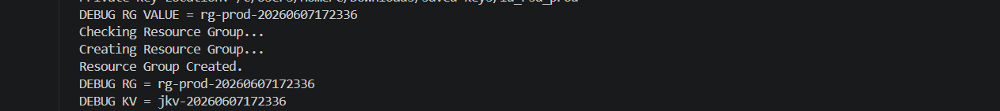
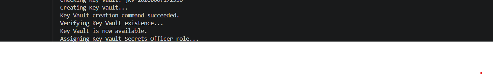
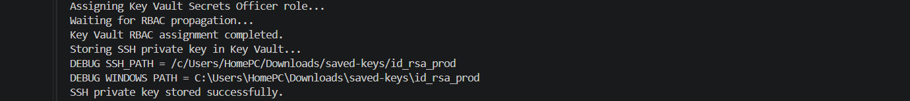
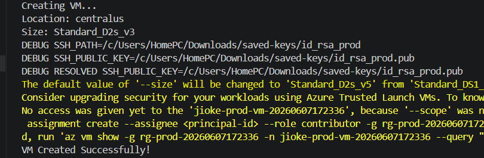
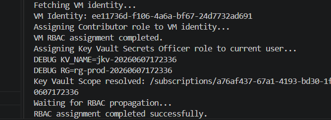
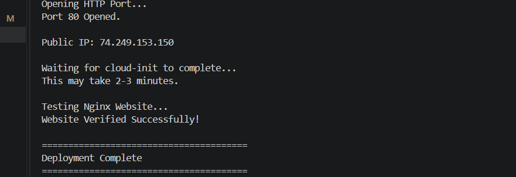

# Modular Azure VM Provisioning Framework

A modular Azure CLI-based automation framework for provisioning and managing Azure Virtual Machines using Bash scripting.

This project was built to demonstrate practical cloud engineering skills including Azure resource deployment, infrastructure automation, modular scripting, version control, security integration, and Infrastructure as Code (IaC) practices.

---

## Overview

The framework automates the end-to-end deployment of Azure infrastructure by breaking deployment tasks into reusable modules.

Instead of maintaining a single large script, each deployment component is separated into dedicated modules responsible for specific infrastructure tasks such as resource group creation, networking, SSH key management, VM provisioning, validation, and cleanup.

This modular design improves:

* Maintainability
* Reusability
* Scalability
* Troubleshooting
* Team collaboration

---

## Features

### Infrastructure Automation

* Automated Azure VM deployment
* Resource Group creation
* Virtual Network creation
* Subnet creation
* Network Security Group configuration
* Public IP allocation
* SSH key generation and management

### Deployment Management

* Pre-deployment validation checks
* Deployment summaries
* Logging and troubleshooting support
* Automated cleanup process

### Version Control

* Git repository management
* GitHub integration
* Feature branching workflow
* Pull Request workflow

### Future Enhancements

* Azure Key Vault integration
* Secure secret retrieval
* Terraform-based infrastructure provisioning
* CI/CD with GitHub Actions
* Remote Terraform state management

---

## Project Structure

```text
azure-vm-project/
│
├── deploy.sh
├── config.env
├── cloud-init.yaml
├── README.md
│
├── logs/
│
└── modules/
    │
    ├── prerequisites.sh
    ├── resource_group.sh
    ├── network.sh
    ├── ssh.sh
    ├── vm.sh
    ├── verification.sh
    ├── summary.sh
    └── cleanup.sh
```

---

## Module Responsibilities

### prerequisites.sh

Performs environment validation before deployment.

Responsibilities:

* Verify Azure CLI installation
* Verify Azure authentication
* Validate required commands
* Check deployment prerequisites

---

### resource_group.sh

Creates and manages Azure Resource Groups.

Responsibilities:

* Create Resource Groups
* Verify Resource Group existence
* Handle Resource Group configuration

---

### network.sh

Deploys networking components.

Responsibilities:

* Create Virtual Networks
* Create Subnets
* Create Network Security Groups
* Configure security rules
* Associate networking resources

---

### ssh.sh

Manages SSH key generation and authentication.

Responsibilities:

* Generate SSH key pairs
* Store private keys securely
* Configure VM SSH access

---

### vm.sh

Deploys Azure Virtual Machines.

Responsibilities:

* Create VM instances
* Configure VM settings
* Attach networking resources
* Configure administrative access

---

### verification.sh

Validates deployment success.

Responsibilities:

* Verify VM deployment
* Verify network configuration
* Verify connectivity
* Verify resource availability

---

### summary.sh

Displays deployment output.

Responsibilities:

* Display VM details
* Display Public IP
* Display Resource Group information
* Provide deployment summary

---

### cleanup.sh

Handles resource removal.

Responsibilities:

* Delete deployed resources
* Remove test environments
* Clean up deployment artifacts

---

## Configuration Files

### deploy.sh

The main orchestration script.

This script coordinates the deployment process by calling all required modules in the correct sequence.

Example:

```bash
./deploy.sh
```

---

### config.env

Stores deployment variables and environment-specific settings.

Examples:

```text
RESOURCE_GROUP=my-rg
LOCATION=eastus
VM_NAME=myvm
ADMIN_USER=azureuser
```

---

### cloud-init.yaml

Stores deployment configuration and project settings in a structured format.

Examples may include:

* Environment definitions
* VM specifications
* Network configurations
* Deployment options

---

## Deployment Workflow

```text
Start
 │
 ▼
Load Configuration
(config.env / cloud-init.yaml)
 │
 ▼
Run Prerequisite Checks
 │
 ▼
Create Resource Group
 │
 ▼
Create Network Resources
 │
 ▼
Generate SSH Keys
 │
 ▼
Deploy Virtual Machine
 │
 ▼
Run Verification Checks
 │
 ▼
Generate Deployment Summary
 │
 ▼
Deployment Complete
```

---

## Technologies Used

* Microsoft Azure
* Azure CLI
* Bash Scripting
* Git
* GitHub
* Linux

---

## Azure Resources Deployed

* Resource Groups
* Virtual Machines
* Virtual Networks
* Subnets
* Network Security Groups
* Public IP Addresses
* SSH Keys

---

## Git Workflow

### Clone Repository

```bash
git clone <repository-url>
```

### Create Feature Branch

```bash
git checkout -b feature-name
```

### Stage Changes

```bash
git add .
```

### Commit Changes

```bash
git commit -m "Description of change"
```

### Push Changes

```bash
git push origin feature-name
```

### Create Pull Request

1. Push branch to GitHub
2. Open repository
3. Select Compare & Pull Request
4. Review changes
5. Merge Pull Request

---

## Current Learning Roadmap

### Phase 1 – Version Control

* [x] Git Installation
* [x] GitHub Repository Creation
* [x] Project Upload to GitHub
* [x] Branch Management
* [x] Pull Requests

### Phase 2 – Security

* [ ] Azure Key Vault Creation
* [ ] Secret Storage
* [ ] Secret Retrieval
* [ ] Secret Integration into Deployment Scripts

### Phase 3 – Infrastructure as Code

* [ ] Terraform Installation
* [ ] Terraform Resource Group Deployment
* [ ] Terraform Plan
* [ ] Terraform Apply
* [ ] Terraform Destroy

### Phase 4 – Advanced Automation

* [ ] GitHub Actions
* [ ] CI/CD Pipeline
* [ ] Automated Validation
* [ ] Infrastructure Testing

---
## Azure Key Vault Integration (version 2)

### Overview

To improve security and eliminate hardcoded secrets, this project integrates Azure Key Vault for centralized secret management.

The Key Vault module is responsible for:

* Creating an Azure Key Vault
* Storing secrets securely
* Retrieving secrets when required
* Supporting future enhancements such as Managed Identity and automated secret injection

### Configuration

Add the following variables to your local `config.env` file:

```bash
KV_NAME=<your-key-vault-name>
SECRET_NAME=vm-admin-password
```

> Note: `config.env` is excluded from source control and should not be committed to GitHub.

### Module Structure

```text
modules/
├── keyvault.sh
```

### Key Vault Workflow

The deployment pipeline performs the following steps:

1. Validate Azure CLI installation
2. Verify Azure authentication
3. Create SSH keys
4. Create Resource Group
5. Create Azure Key Vault
6. Store deployment secret in Key Vault
7. Create Virtual Machine
8. Configure networking
9. Verify deployment
10. Display deployment summary
11. Cleanup temporary resources

### Key Vault Commands

#### Create Key Vault

```bash
az keyvault create \
  --name <key-vault-name> \
  --resource-group <resource-group> \
  --location <location> \
  --enable-rbac-authorization true
```

#### Store a Secret

```bash
az keyvault secret set \
  --vault-name <key-vault-name> \
  --name vm-admin-password \
  --value "<secret-value>"
```

#### Retrieve a Secret

```bash
az keyvault secret show \
  --vault-name <key-vault-name> \
  --name vm-admin-password \
  --query value -o tsv
```

### Security Benefits

* Removes hardcoded credentials from scripts
* Centralizes secret management
* Supports Azure RBAC authorization
* Prepares the project for CI/CD integration
* Aligns with Azure security best practices

# Version 3 – 
 Azure Managed Identity integration / Automatic secret retrieval during VM provisioning

## Overview

This version upgrades the Azure VM Provisioning Framework by introducing secure secret management through Azure Key Vault and enabling Managed Identity on deployed Virtual Machines.

The objective of this enhancement is to eliminate local secret dependency, improve security posture, and move the project closer to real-world enterprise deployment practices.

---

# New Features Added

## 1. Azure Key Vault Integration

Azure Key Vault is now automatically provisioned during deployment.

### Functionality

- Creates a dedicated Key Vault for each deployment
- Enables Azure RBAC authorization
- Assigns Key Vault Secrets Officer role to the deployment user
- Waits for RBAC propagation before continuing
- Verifies successful Key Vault creation before proceeding

### Deployment Flow

```text
Create Resource Group
        ↓
Create Key Vault
        ↓
Assign RBAC Role
        ↓
Wait for Propagation
        ↓
Continue Deployment
```

---

## 2. SSH Private Key Storage

The framework now stores the generated SSH private key inside Azure Key Vault.

### Benefits

- Prevents dependency on local storage
- Enables future key retrieval
- Provides centralized secret management
- Aligns with enterprise security practices

### Secret Stored

```text
Secret Name:
ssh-private-key
```

### Workflow

```text
Generate SSH Keys
        ↓
Create Key Vault
        ↓
Store Private Key
        ↓
Deploy VM
```

---

## 3. Managed Identity Enabled

Virtual Machines are now deployed with a System Assigned Managed Identity.

### Benefits

- Removes the need for credentials inside the VM
- Enables secure access to Azure services
- Supports future Key Vault secret retrieval
- Enterprise-ready authentication mechanism

### Azure CLI Parameter Used

```bash
--assign-identity
```

---

## 4. Automated RBAC Configuration

RBAC assignments are now automated during deployment.

### Current User

Role Assigned:

```text
Key Vault Secrets Officer
```

Purpose:

- Store secrets in Key Vault
- Manage Key Vault secrets

### VM Identity

Managed Identity is automatically created during VM deployment.

Principal ID retrieval:

```bash
az vm show \
  --resource-group <resource-group> \
  --name <vm-name> \
  --query identity.principalId
```

---

# Updated Deployment Workflow

```text
Check Azure CLI
        ↓
Verify Azure Login
        ↓
Set Subscription Context
        ↓
Generate SSH Keys
        ↓
Create Resource Group
        ↓
Create Key Vault
        ↓
Assign Key Vault RBAC
        ↓
Store SSH Private Key
        ↓
Create VM
        ↓
Enable Managed Identity
        ↓
Assign RBAC
        ↓
Open HTTP Port
        ↓
Get Public IP
        ↓
Verify Nginx Deployment
        ↓
Display Summary
```

---

# Challenges Encountered During Implementation

This phase involved extensive troubleshooting and debugging.

---

## Challenge 1 – Missing Subscription Error

### Error

```text
(MissingSubscription)
The request did not have a subscription or a valid tenant level resource provider.
```

### Cause

Azure CLI context was not consistently available during role assignment operations.

### Resolution

Explicit subscription selection was added.

```bash
SUBSCRIPTION_ID=$(az account show --query id -o tsv)

az account set \
  --subscription "$SUBSCRIPTION_ID"
```

---

## Challenge 2 – Key Vault Scope Resolution Failure

### Error

```text
ERROR: Could not resolve Key Vault scope
```

### Cause

Role assignment attempted before Key Vault provisioning was fully completed.

### Resolution

Added verification loop.

```bash
az keyvault show \
  --name "$KV_NAME" \
  --resource-group "$RG"
```

Deployment now waits until the Key Vault becomes available.

---

## Challenge 3 – Function Not Found

### Error

```text
store_ssh_private_key:
command not found
```

### Cause

Function was referenced in deploy.sh but had not been implemented.

### Resolution

Created:

```bash
store_ssh_private_key()
```

inside:

```text
modules/keyvault.sh
```

---

## Challenge 4 – SSH Private Key Not Found

### Error

```text
No such file or directory
```

### Cause

SSH path referenced:

```text
~/.ssh/
```

while keys actually existed in:

```text
Downloads/saved-keys
```

### Resolution

Updated configuration.

```bash
KEY_DIR="/c/Users/HomePC/Downloads/saved-keys"

SSH_PATH="$KEY_DIR/id_rsa_prod"
```

---

## Challenge 5 – Windows Path vs Git Bash Path

### Error

Azure CLI could not locate key files.

### Cause

Windows path formats conflicted with Git Bash path formats.

Examples:

```text
C:\Users\HomePC\Downloads\saved-keys
```

vs

```text
/c/Users/HomePC/Downloads/saved-keys
```

### Resolution

Path conversion added.

```bash
WINDOWS_SSH_PATH=$(cygpath -w "$SSH_PATH")
```

---

## Challenge 6 – Public Key Variable Empty

### Error

```text
DEBUG SSH_PUBLIC_KEY=
```

### Cause

Variable was missing from runtime context.

### Resolution

Generated dynamically.

```bash
SSH_PUBLIC_KEY="${SSH_PATH}.pub"
```

---

## Challenge 7 – VM Creation Failed

### Error

```text
An RSA key file or key value
must be supplied to SSH Key Value
```

### Cause

Azure CLI was not receiving the public key correctly.

### Resolution

Validated:

```bash
if [ ! -f "$SSH_PUBLIC_KEY" ]
```

before deployment.

---

## Challenge 8 – Managed Identity Contributor Warning

### Message

```text
No access was given yet to the VM
because '--scope' was not provided.
```

### Cause

Azure automatically warns when a Managed Identity is created without role assignments.

### Resolution

Identified as informational.

The VM deploys successfully.

Future enhancement can automatically assign:

```text
Contributor
```

or

```text
Key Vault Secrets User
```

roles to the VM identity.

---

# Sample Deployment Output

```text
Resource Group Created.
Key Vault Created.
RBAC Assignment Completed.
SSH Private Key Stored.
VM Created Successfully.
Managed Identity Enabled.
Public IP Retrieved.
Website Verified Successfully.
Deployment Complete.
```

---

# Project Structure After Enhancement

```text
project-root
│
├── deploy.sh
├── config-prod.env
│
├── modules
│   ├── prerequisites.sh
│   ├── ssh.sh
│   ├── resourcegroup.sh
│   ├── network.sh
│   ├── keyvault.sh
│   ├── vm.sh
│   ├── rbac.sh
│   ├── verification.sh
│   ├── summary.sh
│   └── cleanup.sh
│
└── cloud-init.yaml
```

---

# Screenshots Section


## Screenshot 1 – Resource Group Creation



---

## Screenshot 2 – Key Vault Deployment




## Screenshot 3 – Key Vault Secret Storage



```

## Screenshot 4 – VM Deployment Success




## Screenshot 5 – Managed Identity Enabled




```

## Screenshot 6 – Nginx Verification


---

# Skills Demonstrated

- Azure Resource Groups
- Azure Virtual Machines
- Azure Key Vault
- Azure RBAC
- Azure Managed Identity
- Azure CLI
- Bash Scripting
- Infrastructure Automation
- Secret Management
- Linux Administration
- Cloud Security Fundamentals
- Troubleshooting & Debugging
- Modular Script Architecture

---

# Version Summary

### Version 1

- Automated Azure VM Deployment
- Resource Group Creation
- SSH Authentication
- Nginx Installation
- Modular Bash Architecture

### Version 2

- Azure Key Vault Integration

### Version 3

- SSH Private Key Storage
- RBAC Automation
- Managed Identity Enablement
- Subscription Context Handling
- Enhanced Validation & Error Handling
- Enterprise Security Improvements

---


### Future Enhancements

* GitHub Actions deployment pipeline
* Multi-environment support (Development, Test, Production)

## Future Improvements

* Secure credential management
* Terraform migration
* Multi-environment deployments
* Automated CI/CD pipelines
* Infrastructure testing and validation
* Monitoring and alerting integration

---

## Author

### Chijioke C. Odoh

Cloud Infrastructure & Systems Engineer

GitHub:
https://github.com/Jiokechris

LinkedIn:
https://www.linkedin.com/in/chijioke-odoh-a263001bb
